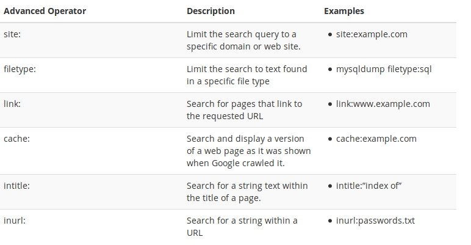
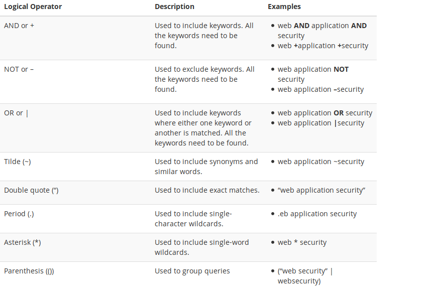

# Recolección de información

## ¿Qué podemos definir como recolección de información?

Como su propio nombre indica consiste en obtener información sobre el sistema que vamos a atacar, sin embargo, tenemos que hacer una distintición entre:

* **Pasive Footprinting** o recolección pasiva de información: Este proceso consiste en consultar información pública en internet relacionada con la infraestructura que estamos atacando
* **Active Footprinting** o recolección activa de informació: Este proceso consiste en interactuar directamente con los dispostivos de la empresa, de forma que se puedan obtener protocolos, puertos de conexión, entre otros.

### Passive Footprinting: Hacking con buscadores
La recolección pasiva de información se basa principalmente en la búsqueda de información sobre la empresa utilizando recursos como la información del domino (resultado de _whois_). Sin embargo, con el objetivo que tenemos en esta presentación, nos centraremos en otra técnica de passive footprinting, esta es el **hacking con buscadores**.

El hacking con buscadores consiste en un conjunto de técnicas que nos permiten encontrar información más precisa haciendo uso de los operadores de los buscadores. Esta técnica es conocida como Google Hacking o Google dorking.

A pesar de las búsquedas aparentemente exactas que nos ofrece Google buscando sobre cualquier tema, podemos encontrar ciertos operadores que nos permiten encontrar información más precisa. Un claro ejemplo de esto sería encontrar todos los documentos de un determinado dominio o encontrar información de una misma persona en diferentes redes sociales.

Un objetivo a considerar del hacking con buscadores consiste en **reducir el número de resultados** de forma que analizar dicho contenido no suponga muzho esfuerzo (ni humano ni computacional).

Para poder aplicar esta técnica en primer lugar tenemos que conocer los operadores de búsqueda que nos ofrece Google, los cuales se muestran a conituación.

Con los operadores mostrados anteriormente podemos conformar los llamados **dorks** que son combinaciones de operadores que nos permiten encontrar información sensible de diferente carácter. Podemos encontrar gran cantidad de dork en el [Google Hacking Database](https://www.exploit-db.com/google-hacking-database)
## OSINT (Open Source Intelligence )

Podemos definir OSINT en español como inteligencia de fuentes abiertas. Con esta esqueta traducción nos podemos hacer una muy ligera idea, de lo que supone este término.

Con OSINT nos referimos a la información que existe pública en la red (incluyendo la __Deep Web__), siendo esta información pública,gratuita y desclasificada. El matiz que diferencias la fuentes OSINT es que son **fuentes utilizadas para crear inteligencia**

La importancia de las fuentes OSINT radica en que nos permite crear inteligencia que nos permita tomar decisiones en múltiples situaciones. En base a la información recogida podrémos decidir nuestra forma de actuar.

Existen diversas herramientas OSINT como maltego, que nos proporcionan múltiples funcionalidades, sin embargo, estas herramientas suelen ser de pago y los resultados están limitados.

### Obteniendo información de Twitter: tweepy

Como alternativa para este escenario hemos decidio utilizar una biblioteca de Python llamada _Tweepy_ que nos permite realizar consultas a la API de Twitter y de esta forma obtener información relacionada con dicha red social.

¿Qué pretendemos lograr con este script? La respuesta es muy simple, podemos estar monitoreando la cuenta de la victima para conocer sus publicaciones, con estas publicaciones podremos obtener información como horarios de salida, dispositivos que utiliza entre otras.

