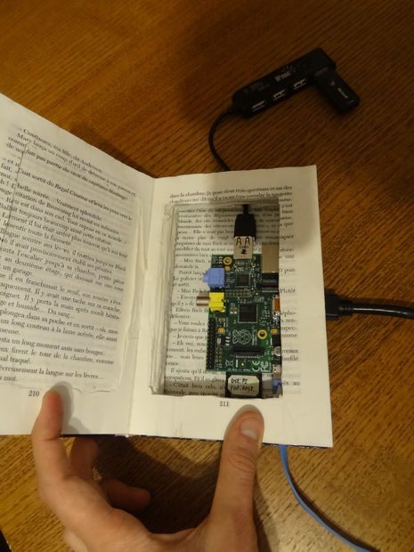

# Preparando el arsenal

## Configurando la Raspberry  PI como herramienta de hacking

### ¿Qué es una Raspberry?
El proyecto [Raspberry Pi](https://www.raspberrypi.org/) consiste en una serie de ordenadores cuyo principal objetivo era potenciar el aprendizaje en entornos educativos así como en paises en vias de desarrollo, sin embargo, gracias al potencial de estos equipos se utilizan para otros muchos fines como robótica o en nuestro caso pentesting.

#### ¿Cuáles son las características que tiene?

  *  Procesador a 1,2 GHz de 64 bits con cuatro núcleos ARMv8.
  *  1GB de Memoria.
  *  802.11n Wireless LAN.
  *  Bluetooth 4.1.
  *  Bluetooth Low Energy (BLE).

  *  4 puertos USB.
  *  40 pines GPIO.
  *  Puerto Full HDMI.
  *  Puerto Ethernet.
  *  Conector combo compuesto de audio y vídeo de 3,5 mm.
  *  Interfaz de la cámara (CSI).
  *  Interfaz de pantalla (DSI).
  *  Ranura para tarjetas microSD (ahora push-pull en lugar de push-push).
  *  Núcleo de gráficos VideoCore IV 3D.
  *  Dimensiones de placa de 8.5 por 5.3 cm.

Como podemos ver nos ofrece una gran serie de posibilidades para un tamaño muy reducido, lo cual nos permitirá llevarlo pasando desapercibidos en cualquier mochila o incluso en libros.

## Escogiendo nuestro sistema
Las raspberry tienen arquitectura ARM de forma que existen una serie de sistemas operativos diseñados especificamente para funcionar en estos dispositivos, entre los cuales podemos destacar [Raspbian](https://www.raspbian.org/) por ser el sistema operativo oficial de Raspberry y [Kali Linux](https://www.offensive-security.com/kali-linux-arm-images/) por ser la distribución más conocida para pentesting y la que estaremos usando.

Cuando hayamos escogido el sistema operativo para trabajar, el siguiente paso será montarlo dentro de la tarjeta SD. En entornos Linux la herramienta recomendada para ello es [dd](https://www.gnu.org/software/coreutils/manual/html_node/dd-invocation.html) y en entornos Windows y Mac podemos optar por [Etcher](https://www.balena.io/etcher/).

### Instalación de Kali Linux usando DD

Cuando obtengamos la imagen de Kali Linux, tendremos que descomprimirla, generalmente viene comprimida con xz. Pasaremos a descompirmir la imagen usando:

    $ xz --decompress kali-linux-raspberrypi.img.xz

Una vez descomprimida la imagen pasarémos a montarla dentro de la tarjeta SD para usarla posteriormente en la raspberry, para ello usaremos la herramienta dd:

    $ dd if=kali-linux-raspberrypi.img of=/dev/sdbX status=progress

Una vez haya finalizado _dd_ podremos iniciar la raspberry y comenzar con la configuración.

## Creando un punto de Acceso propio

Con el fin de utilizar la raspberry de forma remota y sin conexión a internet (puesto que no tenemos esta garantizada), pasaremos a crear un punto de acceso haciendo uso de una antena Wifi (en el caso del modelo raspberry pi 3 puede ser la interna).
Para facilitar el trabajo usaremos un script de configuración que nos automatiza la instalación de un servidor DHCP (dnsmasq) y Hostapd ambos necesarios para la correcta instalación y funcionamiento del punto de acceso.

Podemos encontrar el script en el [repositorio de Github](https://github.com/cyberh99/raspberryAP)

Con esto conseguimos tener acceso por SSH haciendo uso de nuestro móvil o ordenador independientemente de la conexión a internet. Puesto que estaremos trabajando posteriormente con redes wifi es recomendable tener 2 antenas independientes para realizar los ataques descritos en el laboratorio.

!!! info
    Es necesario configurar el sercicio SSH para ejecutarse al inicio, para ello usaremos el comando
    
     sudo systemctl start ssh
